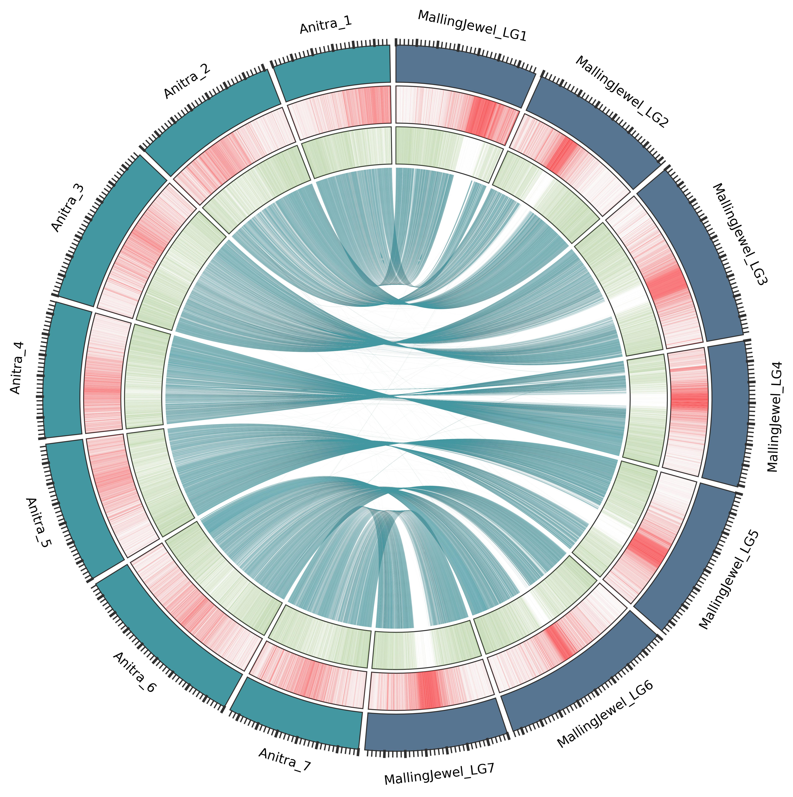

# Genome Assembly, Annotation and Comparative Analysis of *R. idaeus*

Documentation for the genome assembly, annotation and comparative analysis of red raspberry (*Rubus idaeus*) cultivars 'Autumn Bliss' and 'Malling Jewel'.
 
 
[Assembly](./assembly/README.md)
 
[Annotation](./annotation/README.md)
 
[Comparative Analysis](./comparative/README.md)
 

### Citation

Price RJ, Davik J, Fernandéz Fernandéz F, Bates HJ, Lynn S, et al. (2023) Chromosome-scale genome sequence assemblies of the ‘Autumn Bliss’ and ‘Malling Jewel’ cultivars of the highly heterozygous red raspberry (Rubus idaeus L.) derived from long-read Oxford Nanopore sequence data. [PLOS ONE 18(5): e0285756.](https://journals.plos.org/plosone/article?id=10.1371/journal.pone.0285756)

 

