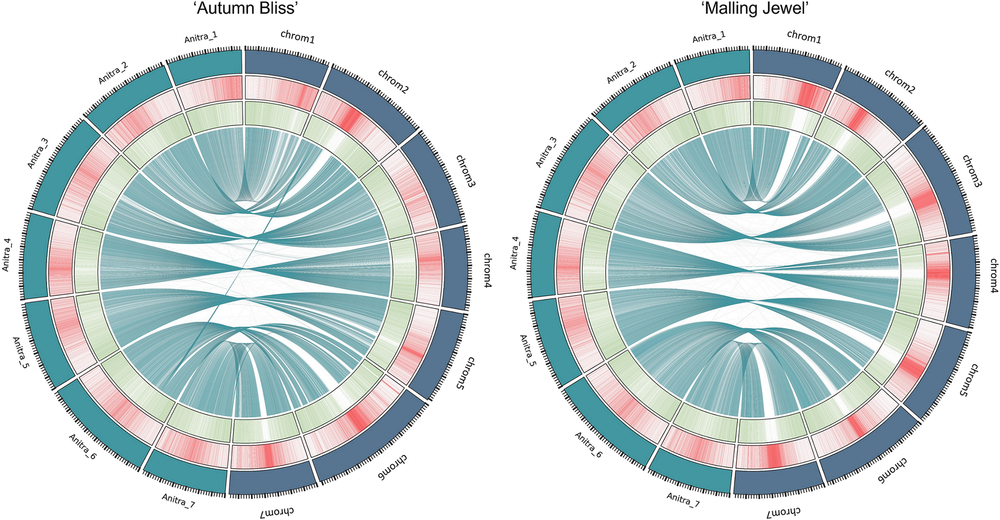

# Comparative Analysis

<center></center>


## Ortholog analysis

for file in *.fasta; do sbatch /mnt/shared/scratch/jnprice/private/scripts/ortholog_analysis/busco_eudicots_proteome.sh $file; done

OrthoFinder

## Genome comparisons
Dot plots were generated using the [D-genies](https://dgenies.toulouse.inra.fr/) online tool.

Circos plots showing the repetitive and coding regions, based on the results of Red and BRAKER (see [Annotation](../annotation/README.md)), and syntenic links based on Satsuma results, were generate using [pyCircos](https://github.com/ponnhide/pyCircos). 


```
sbatch ~/scratch/private/scripts/circos/satsuma_synteny.sh Anitra7LGPLOS.fasta RiAB_ragtag_HiC.fasta circos/Anitra_vs_RiAB

sbatch ~/scratch/private/scripts/circos/satsuma_synteny.sh Anitra7LGPLOS.fasta RiMJ_ragtag_HiC.fasta circos/Anitra_vs_RiMJ
```
pyCircos